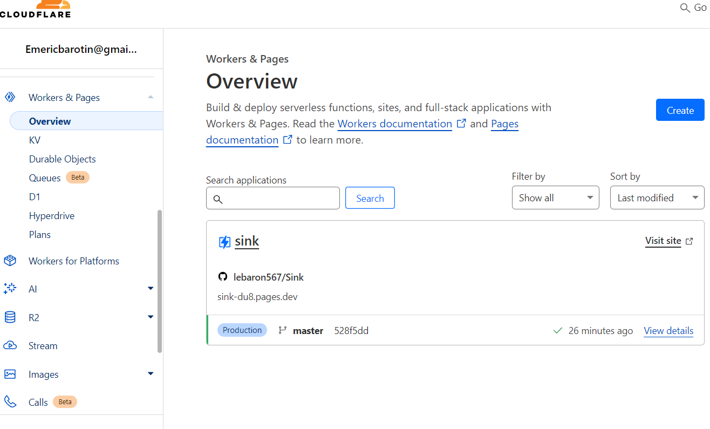

## **Installation**

1. #### **Créez un fork du référentiel sur votre GitHub**
   - Rendez-vous sur le repository original et cliquez sur le bouton "[fork] (https://github.com/ccbikai/Sink/fork "lien github fork")" pour créer une copie dans votre propre compte GitHub.
   

2. #### **Configuration sur Cloudflare**
   - **Accédez à votre [dashboard Cloudflare] https://dash.cloudflare.com/( "lien github fork")**
     - Connectez-vous à votre compte Cloudflare.
     - Allez dans la section **Workers**.
     - Cliquez sur **Create a Worker**.
   
   - **Connexion à GitHub**
     - Allez dans l’onglet **Pages**.
     - Cliquez sur **Connect to Git**.
     - Sélectionnez le repository que vous avez créé en fork.

3. #### **Paramètres de Build**
   - Dans la section **Build settings** :
     - Dans **Framework preset**, sélectionnez **Nuxt.js** comme préréglage.
     - Créez les variables suivantes :
       1. **NUXT_SITE_TOKEN** : Votre token doit avoir une longueur d’au moins 8 caractères.
       2. **NUXT_CF_ACCOUNT_ID** : Utilisez votre identifiant de compte Cloudflare.
       3. **NUXT_CF_API_TOKEN** : Utilisez un jeton API Cloudflare avec l’autorité **Account.Account Analytics**.

4. #### **Trouver votre identifiant de compte Cloudflare**
   - Créez d’abord un compte et un domaine.
   - Sur le dashboard, allez dans **Websites**.
   - Sélectionnez votre domaine pour trouver votre identifiant de compte.
   

5. #### **Créer un jeton API Cloudflare**
   - Accédez à votre profil en haut à droite.
   - Allez dans **API Tokens**.
   - Cliquez sur **Create Token**.
   - En bas de la page, cliquez sur **Create Custom Token** et entrez les permissions adéquates.
   

6. #### **Enregistrer et déployer**
   - Après avoir configuré les variables et les permissions, enregistrez vos paramètres.
   - Déployez votre projet en suivant les instructions fournies sur la plateforme.

## **Paramètres**

Dans le projet, allez dans `Settings > Function` pour :

1. Aller à **KV namespace bindings** pour créer un namespace du nom de `KV` pour l’associer à une variable KV.

2. Aller à **Workers AI Bindings** pour lier le nom de la variable AI au catalogue IA des travailleurs (facultatif).

3. Aller à **Analytics Engine bindings** pour lier le nom de la variable ANALYTICS à l'ensemble de données et activer la version bêta 
de Cloudflare Analytics Engine pour votre compte.

## **Redéployer le projet**
   - Allez dans Deployments.
   - Cliquez sur View details.
   - Cliquez sur Manage deployment pour redéployer votre projet avec les nouveaux paramètres.

  

